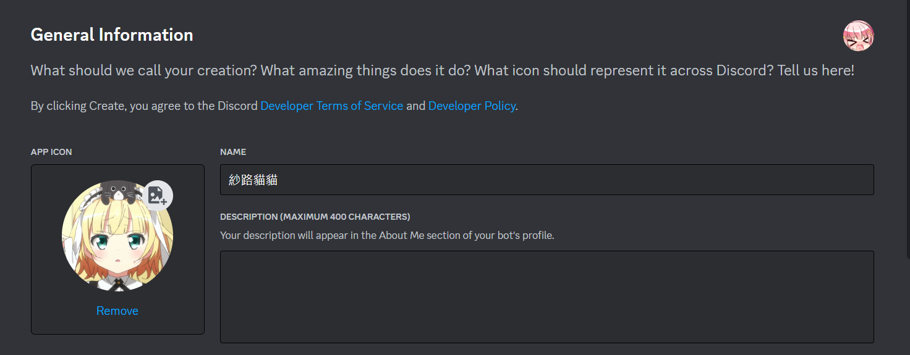

# syaroBot

## 四天連假不知道要幹嘛，就隨便亂做的Discord播歌機器人

## 更新: 將整個程式的功能性完善。



指令如下:

```
\join :(已經可以使用play功能直接呼叫並播歌，此功能已被廢止)讓機器人到發話者的語音頻道
\leave : 讓機器人退出語音頻道
\play YouTube影片網址 : 增加歌曲到播放清單並播放，將playlist(播放清單的功能整合進來)
\look : 查詢當前播放清單
\now : 查詢當前播放歌曲
\skip 次數 : 跳過指定次數的歌曲，沒有次數參數會預設為1首(跳過一首)
\pause : 暫停音樂
\resume : 恢復音樂
```

剛開始播放大量歌曲的播放清單需要等待一定時間(200首大約要15秒)，請耐心等候。

跳過功能請盡量不要連續使用。